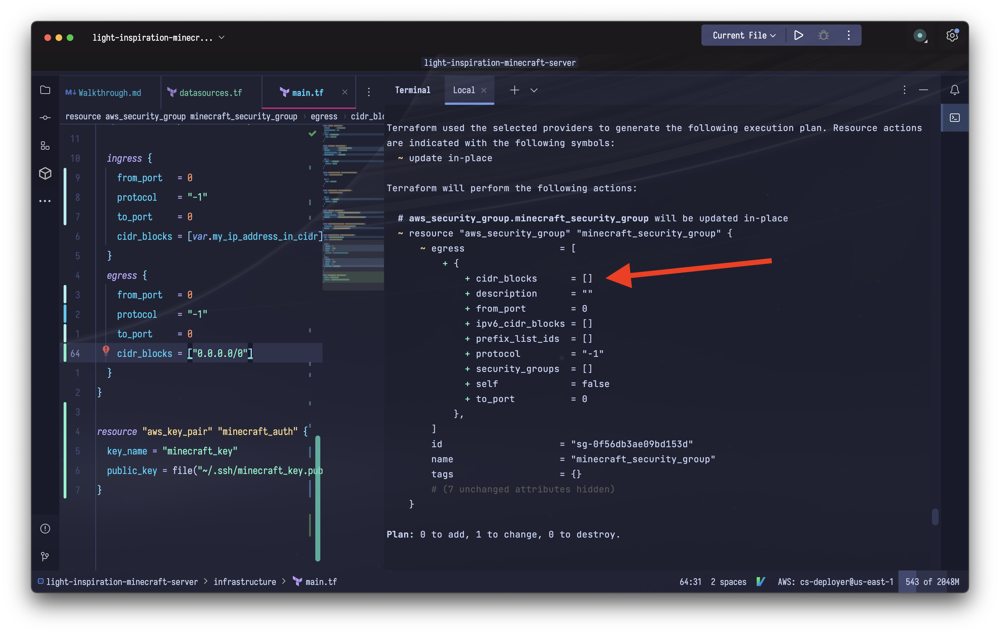

# Light Inspiration Minecraft Server 

## Overview

This is an infrastructure as code project that serves several purposes:

- Setting up a private mincraft server on aws for my family to play on
- As a practical practice project for learning more about aws, terraform, and infrastructure as code in general
- As a engineering learning session demo

## Challenges to overcome
- Pointing the route53 dns records to the ec2 instance ip address in code
- Best way of installing, configuring, and launching minecraft server once the instance is upG
- How do you figure out what you need??
  - Create it via the console -> look at what's made
  - Read ____ in the aws documentation
  - AWS recipes?

## Get up and running
To clone and setup the project run the following shell commands: 

```shell
git clone git@github.com:chris-schmitz/light-inspiration-minecraft-server.git
cd light-inspiration-minecraft-server/infrastructure

cp secrets.tfvars-template secrets.tfvars 
# ! After copying the secrets file look up your external ip address via
# ! something like https://www.ipchicken.com/ and add it as the secret's file `my_ip_address_in_cidr`
# ! value with a /32 at the end. 
# ? e.g. my_ip_address_in_cidr="99.99.99.99/32"
```

To include the variables file when planning and applying use the following commands:
```shell
terraform plan -var-file="secrets.tfvars"
# and 
terraform apply -var-file="secrets.tfvars"
```


## The infrastructure for minecraft server

### Security Group rules
**Inbound rules**:
- 22: ssh
- 25565: minecraft client port

**Outbound rules**:
- All ports

### EC2 instance details
Multiplayer minecraft requires a decent amount of power, so to run it we'll be using a **c6g.medium** EC2 instance type. 

## Planning notes

### Picking the instance type
We're using a `c6g.medium` ec2 instance. This type was decided based on the facts:

- Minecraft java edition requires an ARM processor to run on a linux instance
- We need a decent amount of ram to run multiplayer

### To scale or not to scale
One of the concerns/questions I had while thinking through this project is: how many players can a single minecraft server support -> do we need to be concerned with scaling?

The plan for the server at this point is to have maybe 5 people at the most playing at the same time. Looking it up:

> One minecraft server application can't support more than about 20 players per gb of RAM. Beyond that critical point of ~200 players, however, it's not the RAM that's the problem, but the CPU.

So, considering we're using a `c6g.medium` ec2 instance with 2 gb of ram:
- We're well within the playable limits with our estimated total player count
- Figuring out scaling would be premature optimization
  - Not to mention the concept of scaling a java application that requires player communication and interaction across instances is [a non-trivial task](https://www.worldql.com/posts/2021-08-worldql-scalable-minecraft/)
- If we ever got to the point where we needed more players it would be worth paying for a service that already handles it and transferring our world instance there

## Helpful callouts learned from the project

### terraform state list and show
Instead of looking over an entire terraform state file to find what you need, you can use the `terraform state list` and `terraform state show <name>` commands to peek in on specific parts of the state.

```shell
# within the directory containing your terraform files

# List all of the modules currently installed in state
terraform state list 

# Show state section for specific module
terraform state show <name of module from `state list` command output> 
```

### Terraform format
The terraform cli tool has a `fmt` command that will reformat the `.tf` files in place to give it a consistent format. This may be a command worth adding to an "on save" command or a git hook. 

```shell
terraform fmt # any .tf files in the directory (and subdirectories??) are reformatted
```
### Silent fails
I ran into an instance where a terraform apply would look like it succeeded, but when running a plan right after I would see that certain resources weren't completely applied. I would see the same change in the plan over and over. 

In this particular case it was because I forgot to provide a cidr block value for the egress section:


I call this out because **I never got an error message from terraform**; the change just never applied. I'm assuming what was happening was that terraform didn't fail, it made the aws API calls correctly, it just didn't catch or relay an error happening on the aws side.

Once I added a cidr block value the change applied without issue and the next plan command result was clean. Just something to look out for as you build up your infrastructure.


## Resources
- [Making Amazon Route 53 the DNS service for an existing domain](https://docs.aws.amazon.com/Route53/latest/DeveloperGuide/MigratingDNS.html)
- [Routing traffic to an Amazon EC2 instance](https://docs.aws.amazon.com/Route53/latest/DeveloperGuide/routing-to-ec2-instance.html)
- [Example of a simple route53 -> ec2 instance terraform structure](https://stackoverflow.com/questions/63307373/terraform-route53-simplest-example-to-create-a-dns-record-in-hosted-zone-pointin)
- [Free Code Camp walkthrough re: getting started with aws via terraform](https://www.youtube.com/watch?v=iRaai1IBlB0&ab_channel=freeCodeCamp.org)
- [Terraform's official getting started tutorial](https://developer.hashicorp.com/terraform/tutorials/aws-get-started?utm_source=WEBSITE&utm_medium=WEB_IO&utm_offer=ARTICLE_PAGE&utm_content=DOCS)
- [Terraform gitignore](https://github.com/github/gitignore/blob/main/Terraform.gitignore)
- [Nice brief explanation of CIDR notation](https://www.youtube.com/watch?v=u13AdjAUNmA)

### Terraform tools used
- [aws_provider](https://registry.terraform.io/providers/hashicorp/aws/latest/docs)
- [aws_route53_record](https://registry.terraform.io/providers/hashicorp/aws/latest/docs/resources/route53_record)
- [aws_security_group](https://registry.terraform.io/providers/hashicorp/aws/latest/docs/resources/security_group)
- [aws_instance](https://registry.terraform.io/providers/hashicorp/aws/latest/docs/resources/instance)
- [aws_route_table](https://registry.terraform.io/providers/hashicorp/aws/latest/docs/resources/route_table)
- [aws_route](https://registry.terraform.io/providers/hashicorp/aws/latest/docs/resources/route)
- [aws_security_group](https://registry.terraform.io/providers/hashicorp/aws/latest/docs/resources/security_group)
- [aws_ami](https://registry.terraform.io/providers/hashicorp/aws/latest/docs/data-sources/ami)
- [aws_key_pair](https://registry.terraform.io/providers/hashicorp/aws/latest/docs/resources/key_pair)
- [terraform variables](https://developer.hashicorp.com/terraform/language/values/variables)

### AWS docs
- [internet gateway](https://docs.aws.amazon.com/vpc/latest/userguide/VPC_Internet_Gateway.html)
