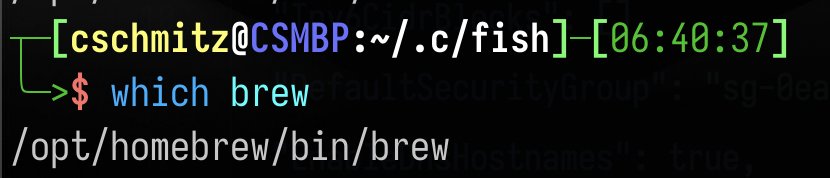

# Walkthrough

If you want a better explained and detailed walk through I would point you to either the [official terraform getting started guide](https://developer.hashicorp.com/terraform/tutorials/aws-get-started?utm_source=WEBSITE&utm_medium=WEB_IO&utm_offer=ARTICLE_PAGE&utm_content=DOCS) or the [FreeCodeCamp walkthrough on getting started with terraform and AWS](https://www.youtube.com/watch?v=iRaai1IBlB0&ab_channel=freeCodeCamp.org). Both explain the steps really well. This walkthrough is really just an abbreviated set of steps I went through for this specific project. The details are light because I followed both of the resources mentioned above, so I just want to call out the important bits and link to the relevant resources. 

## Before you start
- Create an aws account and admin IAM user
- If you don't have a package manager install one
  - [Homebrew for mac](https://brew.sh/) 
  - [Chocolatey for windows](https://chocolatey.org/)
  - You're on linux? You already have your shit together ;) 
- Not required, but if you don't have one, install a code editor or ide
  - [Intellij](https://www.jetbrains.com/idea/download/#section=mac)
  - [VSCode](https://code.visualstudio.com/download)

### A special note about Homebrew if you use Fish shell
The homebrew install instructs you to put the PATH additions in your `.profile` file at the end of the install. This is fine for most shells, but I found that if you use the [fish shell](https://fishshell.com/) the path doesn't get edited because fish doesn't reference `.profile`. 

To make sure the homebrew directories get added to the path you'll want to add the path addition commands:

```shell
# Set PATH, MANPATH, etc., for Homebrew.
eval "$(/opt/homebrew/bin/brew shellenv)"
# Set PATH, MANPATH, etc., for Homebrew.
eval "$(/opt/homebrew/bin/brew shellenv)"
end
```

To your fish config file in `~/.config/fish/config.fish`. When you create a new shell session or re-source your existing session you should have access to the homebrew installed tools. You can check with a:

```shell
which brew
```



## Install cli tools

- [Installing terraform cli tools](https://developer.hashicorp.com/terraform/tutorials/aws-get-started/install-cli)
- [Install aws cli tools](https://docs.aws.amazon.com/cli/latest/userguide/getting-started-install.html)

## Create AWS deployment IAM user and store credentials

## Create terraform files with provider

## run a terraform init

## Add a terraform module

## Run a terraform plan, check, apply, and then confirm